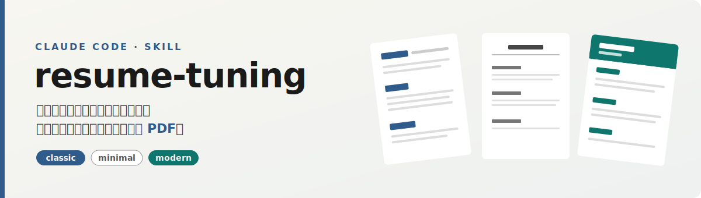

[English](./README_EN.md)




resume-tuning 是一个交互式简历生成器，做成了 Claude Code skill。给它一份旧简历，或者只口述几段经历，它跟你来回几轮，最后交付一份排好版、链接能点、刚好一页的 **PDF**。不挑岗位，技术、产品、设计、运营、还在读书的都能用。

## 能拿到什么

- 一份单页 PDF，不是 Markdown，也不是纯文本。
- **classic / minimal / modern** 三种版式，同一份内容随便切。
- 邮箱、GitHub、个人站、项目、博客全做成点一下就跳的链接。
- 内容按好简历的标准过一遍：该量化的量化、空话删掉、最亮点放最前；专有名词大小写和错别字也顺手校了。
- 缺的数据不替你编，会标出来让你自己补。

## 实际效果

同一段内容，进去前和出来后的差别。

经历段落，改写前：

> 负责服务端开发，提升了系统性能，保证了稳定性。

改写后：

> 主导核心交易接口优化，引入多级缓存与异步解耦，P99 从 800ms 降到 120ms，QPS 提升 5 倍，支撑大促 10 万级并发。

自我评价，改写前：

> 自驱力强，学习能力强，责任心强。

改写后：

> **自驱力强**：工作之余坚持技术博客输出，累计阅读 15 万+。

更多对照见 [`examples/before-after-example.md`](./examples/before-after-example.md)。

## 如何使用

把整个目录丢进你 agent 的 skills 目录，比如 `~/.claude/skills/`：

```bash
git clone https://github.com/anneheartrecord/resume-tuning.git resume-tuning
```

渲染 PDF 用 WeasyPrint，第一次跑之前装一下依赖：

```bash
brew install pango gdk-pixbuf libffi
python3 -m venv ~/.venv && ~/.venv/bin/pip install weasyprint pypdf
```

然后跟你的 AI 助手说一句就行，比如「帮我做份简历，我口述经历给你」「把这份旧简历优化一下导出 PDF」「简历转成英文版」。

## 推荐使用方式

- 一上来就把能给的都给它：旧简历、最想突出的一两点、目标岗位。它问问题的时候尽量答具体，输出质量直接取决于这一步。
- 三种版式初稿出来后，挑一个再让它精修，别一上来就纠结某一版的字号。
- 凡是标了 `[DATA NEEDED]` 的地方，补上真实数字再定稿。别让它替你编，面试一问就穿帮。
- 投不同公司可以让它换版式、调重点，简历不该一份走天下。

## references

判断标准在 [`references/resume-standards.md`](./references/resume-standards.md)，从一套求职实战里攒出来的：简历是份只活 10 秒的销售文案，一页、一行一句、最亮点前置、用数字说话、别堆技能列表、空话要带论据、埋钩子让面试官来问、实事求是、自我评价讲清你从哪来现在在哪想去哪。配套还有一份反复踩坑攒下来的错别字校对清单。

## License

[MIT](./LICENSE)
