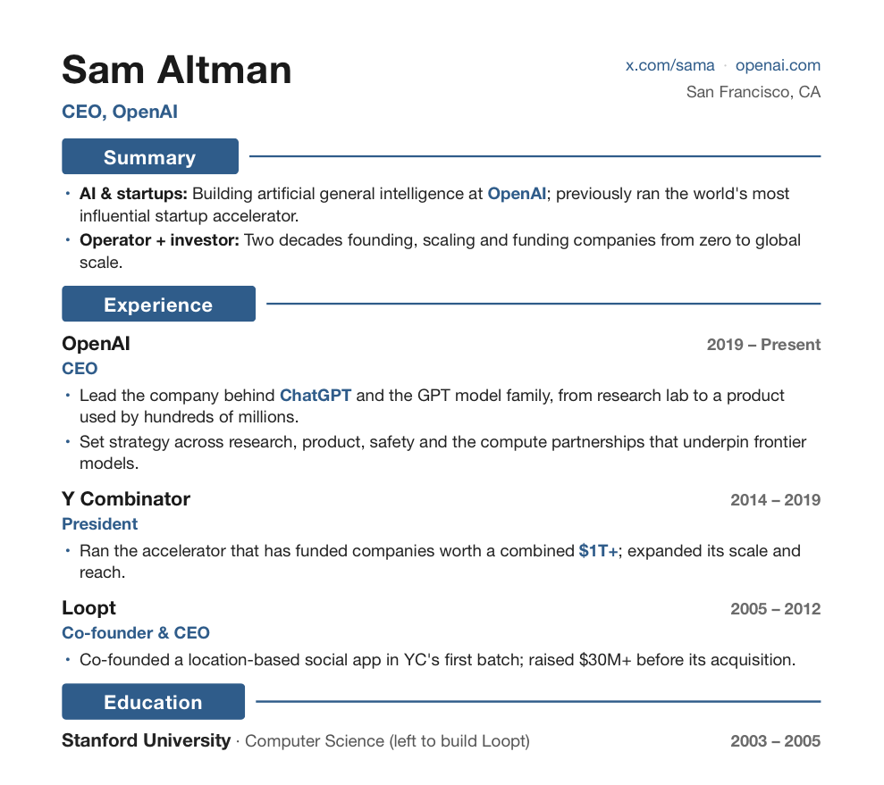
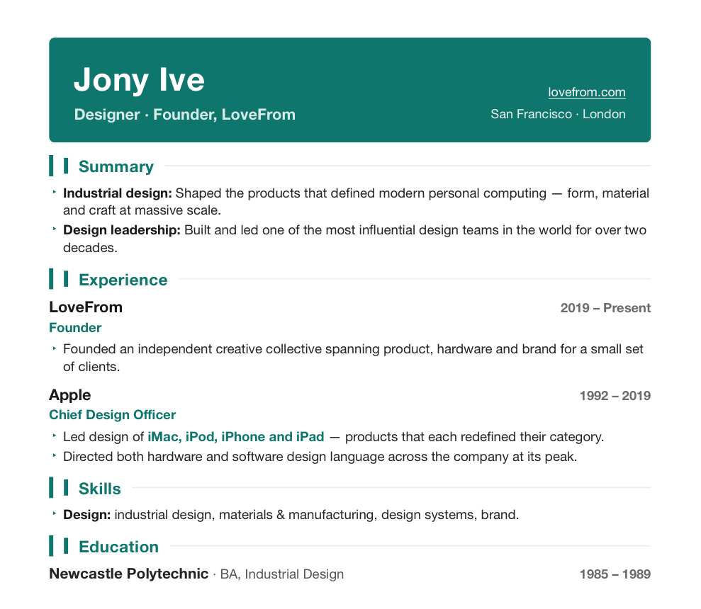
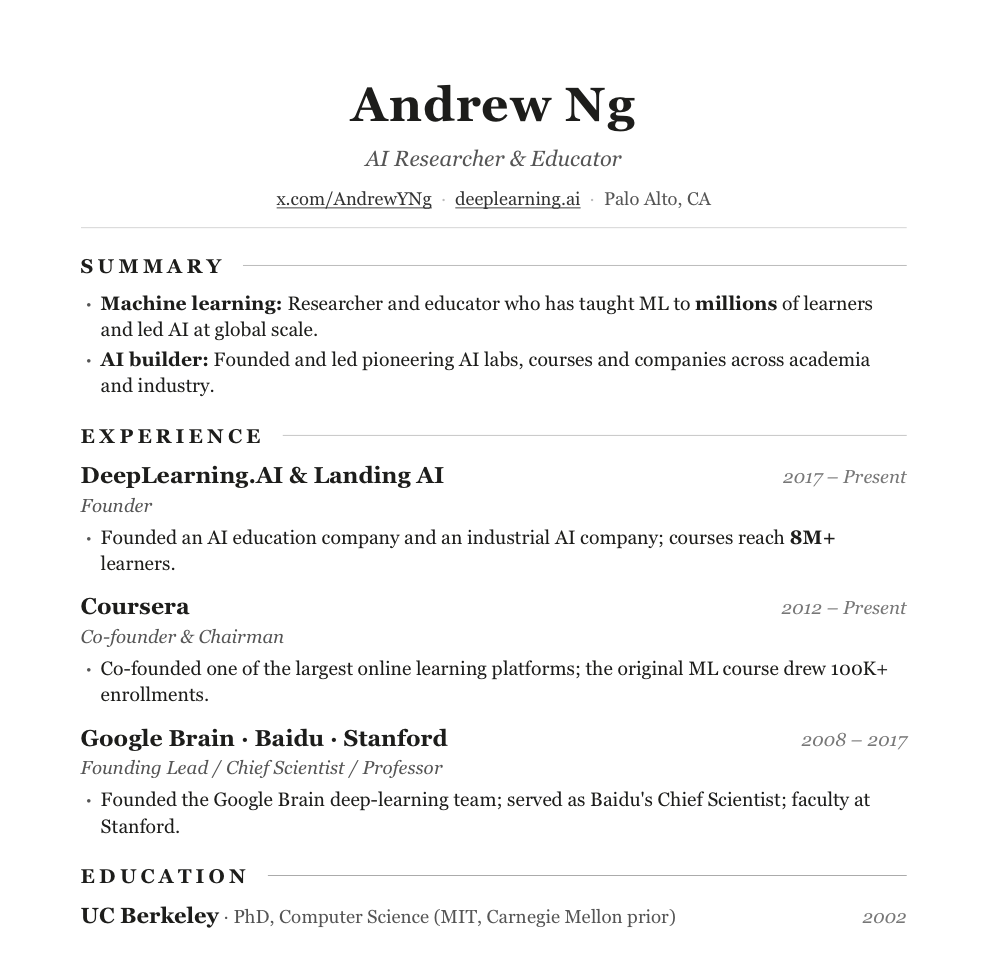

[中文](./README.md)


resume-tuning is an interactive resume generator, packaged as a skill. Give it an old resume, or just talk through a few experiences. It goes a few rounds with you and delivers a typeset, one-page **PDF** with working links. It works for any role — engineering, product, design, marketing, students.

## What you get

- A one-page PDF — not Markdown, not plain text.
- Three layouts — **classic / minimal / modern** — same content, switch freely.
- Email, GitHub, site, projects, blog all turned into clickable links.
- Content run against good-resume standards: quantified, fluff cut, strongest point first; term casing and typos fixed too.
- Missing data is never invented — it's flagged for you to fill.

## What the three layouts look like

The three below are **illustrative samples** built from public figures' public bios (not their actual resumes), each in one layout — also showing how it adapts across roles:

| classic · founder/exec | modern · designer | minimal · academic |
|---|---|---|
|  |  |  |
| Sam Altman | Jony Ive | Andrew Ng |

Typography aesthetics inspired by [tw93/Kami](https://github.com/tw93/Kami).

## What it does, concretely

Same content, before and after.

An experience bullet, before:

> Responsible for server-side development, improved system performance and ensured stability.

After:

> Led optimization of the core transaction API; multi-level cache + async decoupling cut P99 from 800ms to 120ms, lifted QPS 5x, and supported 100K concurrent users during peak sales.

A self-summary, before:

> Self-driven, fast learner, strong sense of responsibility.

After:

> **Self-driven**: kept publishing technical writing outside of work — 150K+ cumulative reads.

More in [`examples/before-after-example.md`](./examples/before-after-example.md).

## How to use

Drop the folder into your agent's skills directory, e.g. `~/.claude/skills/`:

```bash
git clone https://github.com/anneheartrecord/resume-tuning.git resume-tuning
```

Rendering uses WeasyPrint — install the dependencies once:

```bash
brew install pango gdk-pixbuf libffi
python3 -m venv ~/.venv && ~/.venv/bin/pip install weasyprint pypdf
```

Then just tell your AI assistant: "Make me a resume, I'll talk through my experience" / "Optimize this old resume and export a PDF" / "Turn my resume into English."

## Recommended workflow

- Hand over everything up front: the old resume, the one or two things you most want to highlight, the target role. Answer its questions concretely — output quality tracks this step.
- Once the three draft layouts are out, pick one, then refine. Don't fixate on one layout's font size before choosing.
- Wherever it leaves `[DATA NEEDED]`, fill in real numbers before finalizing. Don't let it guess — interviewers will catch it.
- For different companies, let it switch layout and re-weight emphasis. One resume shouldn't fit all.

## references

The standards live in [`references/resume-standards.md`](./references/resume-standards.md), distilled from real job-hunting practice: a resume is sales copy with a 10-second lifespan — one page, one line per point, strongest point first, numbers over adjectives, no bare skill lists, claims backed by evidence, hooks that make the interviewer ask, honesty, and a self-summary that says where you came from, where you are, where you're headed. Plus a proofreading checklist built from repeated mistakes.

## License

[MIT](./LICENSE)
