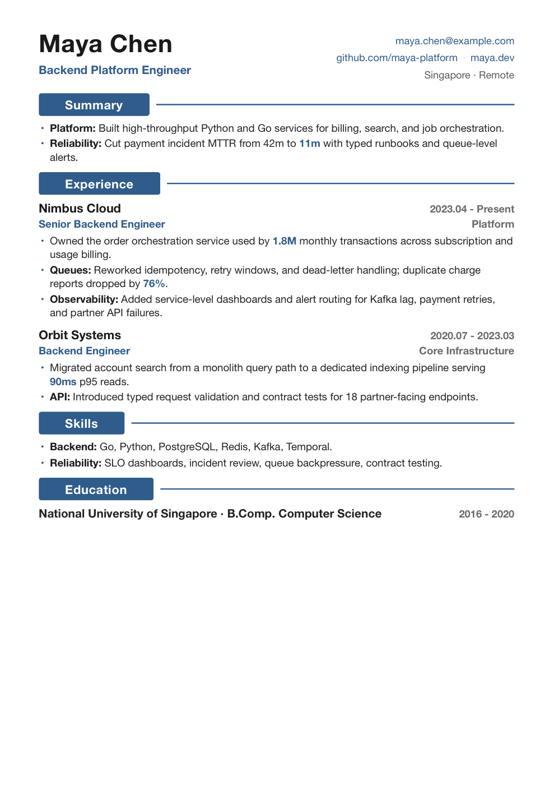
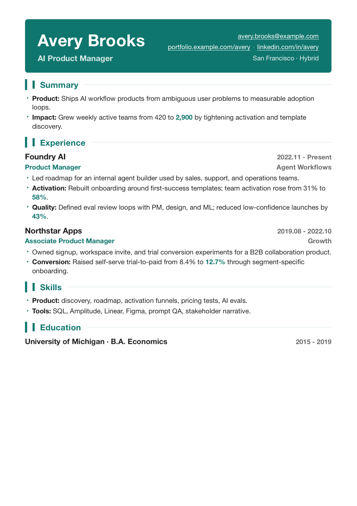
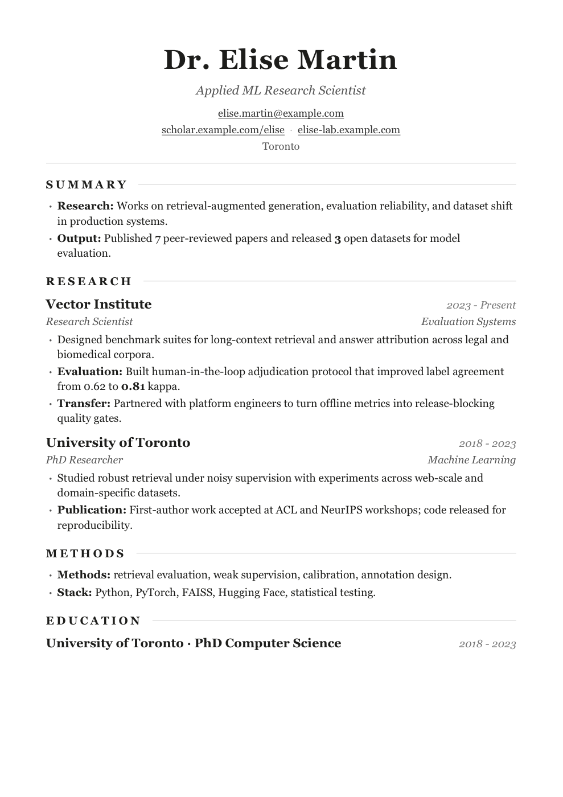
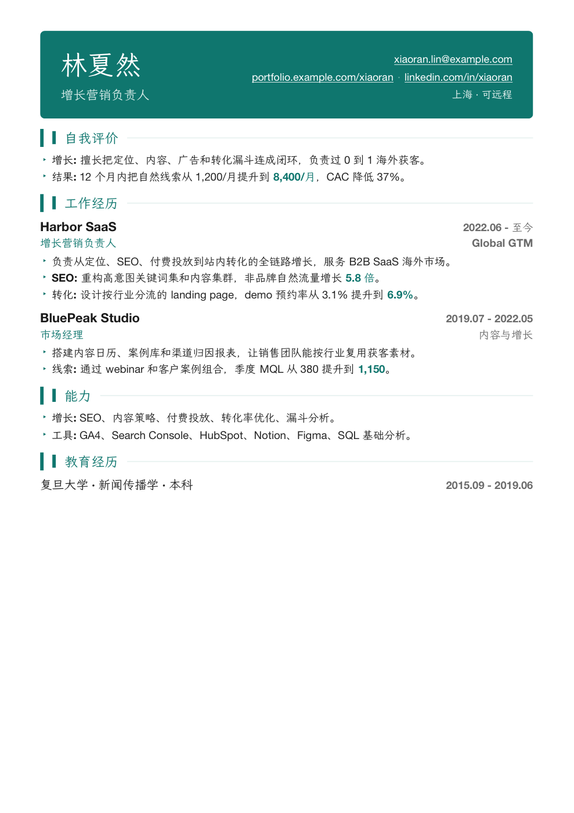
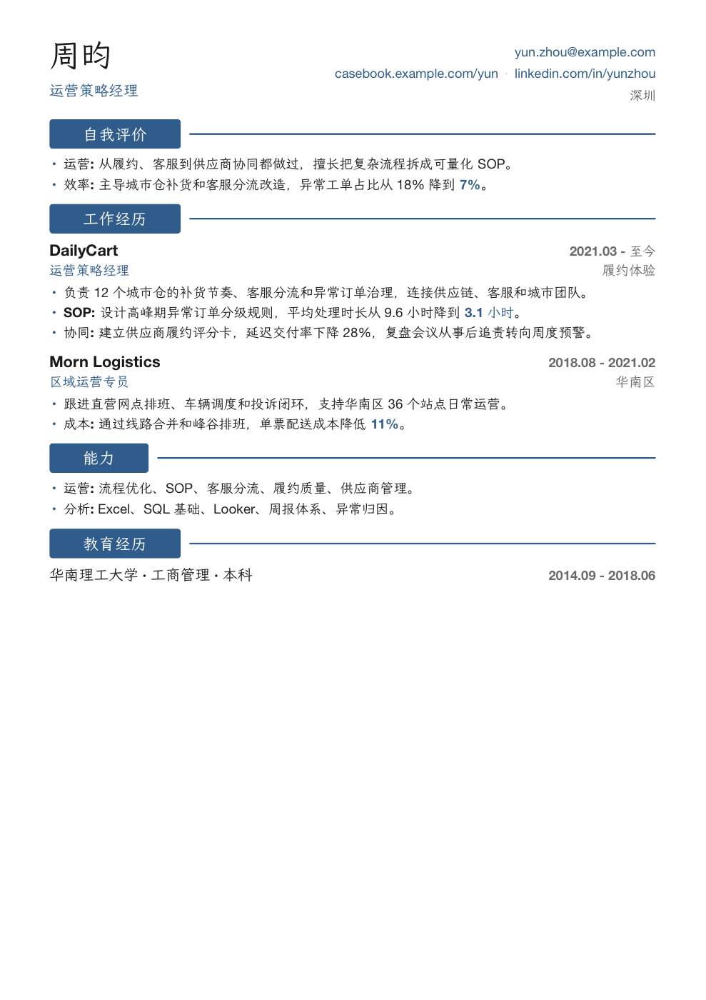
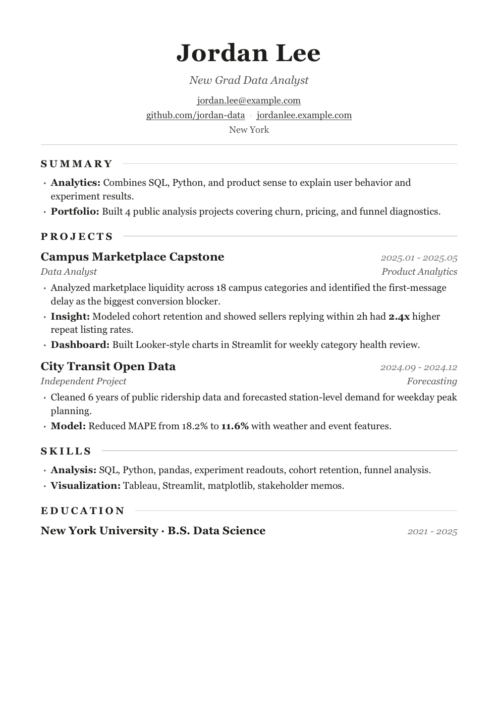

[中文](./README.md)


| Backend · classic | Product · modern | Research · minimal |
|---|---|---|
|  |  |  |
| Growth · modern | Operations · classic | New grad · minimal |
|  |  |  |

> Synthetic demo resumes, not real candidates. The six samples cover backend, product, research, growth, operations, and new-grad scenarios. Typography inspired by [tw93/Kami](https://github.com/tw93/Kami). Regenerate them with `python3 scripts/generate_demo_resumes.py`.

resume-tuning is an interactive resume-building skill. Give it an old resume, or just talk through a few experiences — it goes a few rounds with you and delivers a **one-page PDF with clickable links**. Three layouts (classic / minimal / modern), any role.

It runs the content against good-resume standards: quantify what matters, cut the fluff, strongest point first, fix typos. Missing data is never invented — it's flagged for you to fill.

Paste a target JD and it flags the missing keywords, rephrases experience you genuinely have (but buried) in the recruiter's terms and surfaces it, and runs an ATS readability self-check before finalizing (text layer, standard sections, contact, keyword coverage). It only surfaces what you actually have — it **never stuffs fake keywords** for you, since that collapses under a background check or interview.

Internally, the workflow uses a structured profile as the intermediate layer: old PDFs, images, pasted text, or notes become validated JSON first, then JD matching, content linting, layout previews, and final PDF rendering run from that same source.

Before → after:

> Responsible for server-side development, improved system performance.
> → Led optimization of the core transaction API; multi-level cache + async decoupling cut P99 from 800ms to 120ms, lifted QPS 5x.

## Use it

```bash
git clone https://github.com/anneheartrecord/resume-tuning.git ~/.claude/skills/resume-tuning
brew install pango gdk-pixbuf libffi
python3 -m venv ~/.venv && ~/.venv/bin/pip install weasyprint pypdf
# Optional: install rapidfuzz to enable fuzzy keyword matching in the ATS check (falls back to exact matching otherwise)
# ~/.venv/bin/pip install rapidfuzz
bash resume-tuning/scripts/ensure-fonts.sh   # run once before CJK resumes; auto-fetches an OFL font
```

Then tell your AI assistant "make me a resume" / "optimize this old resume into a PDF" / "translate it to English".
Wherever it leaves `[DATA NEEDED]`, fill in real numbers before finalizing — don't let it guess.

## Toolchain

```bash
python3 scripts/resume_pdf.py extract old.pdf
python3 scripts/resume_profile.py validate examples/profile-example.json
python3 scripts/jd_match.py examples/profile-example.json --jd examples/jd-sample.txt
python3 scripts/resume_lint.py examples/profile-example.json --mode draft
python3 scripts/ats_check.py final.pdf --name "Candidate" --keywords "Go,Kubernetes,Redis"
```

Template metadata lives in [`assets/templates/templates.json`](./assets/templates/templates.json). `preview` prints each layout's fit, ATS level, PDF/PNG paths, and link checks.

## Tests

```bash
python3 scripts/tests/test_skill_structure.py
python3 scripts/tests/test_resume_profile.py
python3 scripts/tests/test_jd_match.py
python3 scripts/tests/test_resume_lint.py
python3 scripts/tests/test_eval_cases.py
python3 scripts/tests/test_ats_check.py
python3 scripts/tests/test_render.py
```

## references

Task workflows live in [`references/intake.md`](./references/intake.md), [`tailor-to-jd.md`](./references/tailor-to-jd.md), [`render-and-deliver.md`](./references/render-and-deliver.md), and [`review-only.md`](./references/review-only.md). The structured profile contract is in [`resume-schema.md`](./references/resume-schema.md). Standards live in [`resume-standards.md`](./references/resume-standards.md), [`resume-writing.md`](./references/resume-writing.md), and [`ats-and-jd.md`](./references/ats-and-jd.md).

## License

[MIT](./LICENSE)
