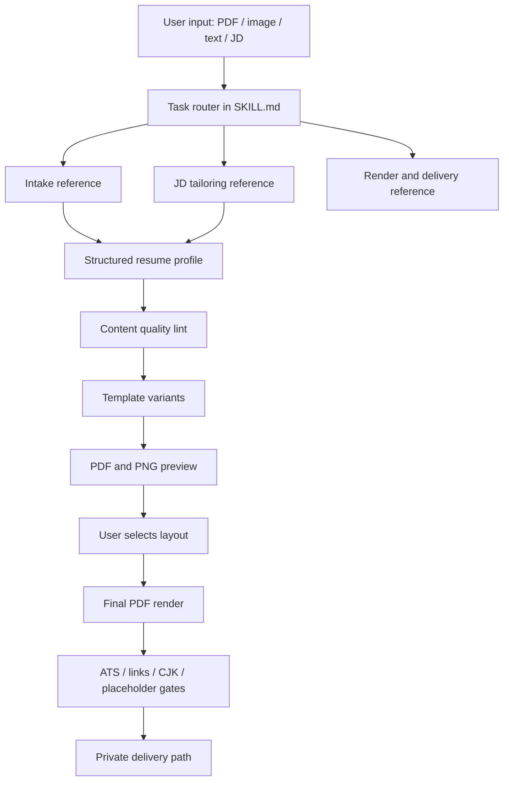

# feat: Upgrade resume-tuning skill quality loop

## Summary

本计划把 `resume-tuning` 从“可生成一页 PDF 的简历优化 skill”升级成一套可复用、可验证、可迭代的简历工作流：任务路由更清晰，结构化中间数据更稳定，JD/ATS/内容质量有确定性门禁，多版式选择和中文 PDF 渲染仍沿用当前已验证链路。

---

## Problem Frame

当前 skill 已经有几个强项：`SKILL.md` 明确交付物是单页 PDF，`references/resume-standards.md` 和 `references/resume-writing.md` 定义了内容质量底线，`references/ats-and-jd.md` 定义了诚实 JD 匹配，`scripts/resume_pdf.py` 覆盖提取、渲染、预览和中文字体，`scripts/ats_check.py` 覆盖 ATS 可读性与关键词覆盖，三套 HTML 模板已经有回归测试。

主要短板不在“能不能渲染”，而在“能不能让另一个 agent 稳定走完整流程”：`SKILL.md` 承担了太多细节，缺少按任务加载的引用文件；缺少类似 RenderCV / cv-claw 的结构化简历中间模型；质量门禁还偏 ATS，缺少内容 lint 和交互状态校验；外部成熟项目已经证明模板预览、schema 校验、严格 validation、eval 和隐私优先是简历工具受欢迎的核心能力。

---

## Requirements

### Skill Architecture

- R1. `SKILL.md` 保持轻入口，只描述触发、核心原则和任务路由，细节拆到 `references/` 下按需读取。
- R2. Skill frontmatter 只保留 `name` 和 `description`，把版本、受众、交付物等说明移入正文或 `agents/openai.yaml`。
- R3. 每个任务路径必须有明确入口：导入旧简历、从零生成、按 JD 定制、渲染交付、只做诊断。
- R4. 所有新增资源必须遵守 progressive disclosure：主入口不重复长标准，详细规则只在任务需要时读取。

### Resume Data and Intake

- R5. 引入结构化简历中间模型，用于在多版式、多轮 JD 定制和最终渲染之间保持内容一致。
- R6. 输入提取必须覆盖 PDF 文本层、扫描/图片型 PDF、纯文本/口述、已有链接四类来源。
- R7. 缺失信息必须进入显式追问或 `[DATA NEEDED: ...]`，不能在结构化模型、HTML 或 PDF 中编造。
- R8. 候选人身份、目标岗位、语言、可选模块和隐私场景必须在进入定稿前被记录为可复核状态。

### Content Quality and JD Match

- R9. 内容优化继续以 STAR、最亮点前置、量化结果、技能压缩和 anti-stuffing 为硬约束。
- R10. JD 匹配必须输出“已覆盖 / 有但没突出 / 真没有”三档结果，只有“有但没突出”能进入简历改写。
- R11. 新增内容质量 lint，覆盖 `[DATA NEEDED]` 泄漏、空洞形容词、无结果 bullet、过度高亮、非标准章节标题和明显一页风险。
- R12. 技术岗、非技术岗、学生/应届、学术/研究四类身份必须有差异化排序和内容侧重点。

### Rendering and Delivery

- R13. 保留当前 HTML template + WeasyPrint + CJK font 的 PDF 渲染链路，不引入浏览器服务或 LaTeX 作为默认路径。
- R14. 多版式初稿必须能产出可比对的 PDF/PNG 预览，并给用户明确选择依据。
- R15. 定稿前必须验证一页、链接、占位符、ATS 可读性、中文 glyph 和阅读顺序。
- R16. 输出默认落在私密简历目录或用户指定路径，不把真实简历、JD 或个人信息提交进仓库。

### Validation and Evaluation

- R17. 新增 skill 结构测试，确保 `SKILL.md` 引用的 reference/script/template 都存在，入口文件不过度膨胀。
- R18. 新增结构化模型和内容 lint 的单元测试，避免把校验逻辑埋在 prompt 里。
- R19. 新增少量 eval case，覆盖旧 PDF 导入、JD 定制、中文简历、扫描件路径和缺数字场景。
- R20. README / README_EN 必须同步反映新流程，但保持简洁技术文档风格。

---

## Key Technical Decisions

- KTD1. 保留现有渲染链路：外部高星项目有 React、LaTeX、Pandoc 多条路线，但本仓库已经用 `scripts/resume_pdf.py` 解决一页、自适应、链接和中文字体，替换渲染栈会放大风险。
- KTD2. 借鉴 RenderCV 的 schema + validation 思路，而不是引入 RenderCV runtime：RenderCV 的强项是 YAML、Pydantic 校验、主题和 eval；本 skill 的差异化是中文、本地隐私、交互式优化和现有 HTML 模板。
- KTD3. 借鉴 cv-claw 的任务路由方式：`SKILL.md` 保持短，`references/intake.md`、`references/tailor-to-jd.md`、`references/render-and-deliver.md` 等按任务加载。
- KTD4. 用轻量 JSON 中间模型稳定内容，不把 HTML 当内容源：HTML 只负责最终排版，内容编辑、JD 定制和质量 lint 都围绕结构化数据执行。
- KTD5. 新增脚本时优先新建小模块，避免继续膨胀 `scripts/ats_check.py` 和 `scripts/resume_pdf.py`：当前两个脚本分别 388 行和 304 行，继续堆功能会接近单文件 500 行上限。
- KTD6. 质量门禁分两层：确定性脚本只产出事实和硬伤，agent 负责结合用户真实性做三档判断和写作取舍。
- KTD7. 不追求模板数量竞争：Reactive Resume 和 JadeAI 的模板数量是产品优势，但这个 skill 更需要少量高质量、ATS 可靠、可测的模板和清晰选版式理由。

---

## High-Level Technical Design

结构化模型是 workflow 的稳定中心。导入、改写、JD 匹配和模板切换都更新同一份中间数据，HTML/PDF 只是派生产物。脚本门禁只判断事实，不替用户决定能不能写某个经历。

---

## Scope Boundaries

### In Scope

- 重构 skill 入口和 references 组织方式。
- 增加结构化简历中间模型、校验器、示例和测试。
- 增加内容质量 lint、JD 匹配分档报告和 eval case。
- 强化多版式预览、交付前 checklist 和 README 双语说明。

### Deferred to Follow-Up Work

- 增加 DOCX / LaTeX / JSON Resume 导出。
- 做完整 Web UI、拖拽编辑器或多简历 dashboard。
- 接入真实 ATS 平台 API 或商业评分。
- 增加 cover letter、模拟面试、求职 Kanban 等求职工作台能力。

### Out of Scope

- 为了 ATS 分数伪造关键词、经历、数字或职责。
- 把用户真实简历、JD 或个人信息作为仓库测试 fixture。
- 默认改用云端 LLM 或上传用户简历到外部服务。

---

## Implementation Units

### U1. Skill entry and routing split

**Goal:** 把 `SKILL.md` 变成短入口，按任务路由到细分 reference，降低后续 agent 一次性加载负担。

**Requirements:** R1, R2, R3, R4.

**Dependencies:** None.

**Files:**

- `SKILL.md`
- `references/intake.md`
- `references/tailor-to-jd.md`
- `references/render-and-deliver.md`
- `references/review-only.md`
- `references/resume-schema.md`
- `agents/openai.yaml`
- `scripts/tests/test_skill_structure.py`

**Approach:** 保留现有核心原则：交付 PDF、一页、交互式、多版式、隐私、不编造。把提取、追问、结构化、JD 匹配、渲染、交付的细节拆出。新增结构测试验证 frontmatter、引用链接和入口长度。

**Patterns to follow:** `cv-claw` 的任务路由表；`skill-creator` 对 `SKILL.md` frontmatter 和 progressive disclosure 的约束。

**Test scenarios:**

- 给定 `SKILL.md`，结构测试应确认 frontmatter 只有 `name` 和 `description`。
- 给定 `SKILL.md` 中每个 reference 链接，结构测试应确认目标文件存在。
- 给定新增 `agents/openai.yaml`，结构测试应确认 display name、short description 和 default prompt 与 skill 功能一致。
- 给定入口文件行数超过约定阈值，结构测试应失败并提示继续拆分。

**Verification:** 入口文件更短，任务路由完整，旧触发词仍能匹配“做/调整/优化简历、转英文、排版、PDF 简历”等场景。

### U2. Structured resume profile model

**Goal:** 引入可验证的结构化中间模型，让导入、JD 定制、多版式渲染和质量 lint 使用同一份内容源。

**Requirements:** R5, R7, R8, R12.

**Dependencies:** U1.

**Files:**

- `references/resume-schema.md`
- `examples/profile-example.json`
- `examples/before-after-example.md`
- `scripts/resume_profile.py`
- `scripts/tests/test_resume_profile.py`

**Approach:** 定义轻量 JSON shape：header、target、summary、experience、projects、education、skills、optional_sections、links、privacy_mode、data_needed。先用标准库 validator 实现严格字段检查，避免新增重依赖。模型中的日期、链接、职位措辞和 `[DATA NEEDED]` 必须保真。

**Patterns to follow:** RenderCV 的 schema validation；cv-claw 的 `header + sections[]` 结构；当前 `references/resume-writing.md` 的身份排序和 section 标准。

**Test scenarios:**

- 给定合法 profile JSON，validator 应通过并保留 section 顺序。
- 给定未知字段，validator 应失败并指出路径。
- 给定缺失姓名或空 experience/projects/education 组合，validator 应返回可解释错误或 warnings。
- 给定含 `[DATA NEEDED]` 的经历，validator 应保留标记，不自动删除或补数字。
- 给定手机号和公开分享 privacy mode，validator 应提示交付前确认是否隐藏手机号。

**Verification:** agent 可以从 profile 生成任一模板 HTML，JD 定制也可以保存为 profile variant，而不是直接改 HTML。

### U3. Intake workflow hardening

**Goal:** 让旧简历导入流程可复核，覆盖文本 PDF、扫描件、图片、粘贴文本和链接保留。

**Requirements:** R6, R7, R8, R16.

**Dependencies:** U1, U2.

**Files:**

- `references/intake.md`
- `scripts/resume_pdf.py`
- `scripts/resume_profile.py`
- `scripts/tests/test_render.py`
- `scripts/tests/test_resume_profile.py`

**Approach:** 为 `extract` 增加结构化报告输出，明确 `TEXT_BASED` / `IMAGE_BASED` / links / text chars。reference 规定扫描件必须走视觉 OCR 转写，转写后再进入 profile。导入流程必须列出已知项和缺失项，避免重复追问。

**Patterns to follow:** 当前 `resume_pdf.py extract` 的 verdict 输出；OpenResume 的 “Import From Existing Resume PDF”；cv-claw 的 ingest 流程。

**Test scenarios:**

- 给定有文本层 PDF，extract report 应包含页数、字符数、链接和 `TEXT_BASED` verdict。
- 给定文本层不足阈值的 PDF fixture，extract report 应输出 `IMAGE_BASED` verdict。
- 给定带 mailto/GitHub 链接 PDF，导入后的 profile 应保留链接。
- 给定用户粘贴纯文本，reference 流程应要求先结构化再优化，不直接渲染。

**Verification:** 导入流程能产出一份 profile draft，并明确哪些字段来自源简历、哪些需要用户补充。

### U4. Honest JD tailoring and ATS report

**Goal:** 把当前 ATS/JD 规则变成可执行的分档报告和改写流程，避免关键词堆砌。

**Requirements:** R9, R10, R12, R15.

**Dependencies:** U2, U3.

**Files:**

- `references/tailor-to-jd.md`
- `references/ats-and-jd.md`
- `scripts/jd_match.py`
- `scripts/ats_check.py`
- `scripts/tests/test_jd_match.py`
- `scripts/tests/test_ats_check.py`
- `examples/jd-sample.txt`

**Approach:** 把语义分档从 `ats_check.py` 的机械覆盖率中拆出来。`ats_check.py` 继续负责 PDF 可读性和关键词命中事实；`jd_match.py` 负责从 profile 与 JD 生成候选分档 report，agent 再向用户确认“有但没突出”和“真没有”的边界。

**Patterns to follow:** 当前 `references/ats-and-jd.md` 的三档处理；JadeAI 的 JD Match Analysis；resume-ai 的 ATS hidden-content warning。

**Test scenarios:**

- 给定 JD 要求 Kubernetes，profile 有“容器编排/K8s”经历时，报告应标为“有但没突出”。
- 给定 JD 要求 Rust，profile 没有任何相关证据时，报告应标为“真没有”，且不得进入改写建议。
- 给定短关键词 `C`、`Go`、`SQL`，匹配应遵守边界规则，不误命中 `C++`、`go-lang` 或 `SQS`。
- 给定中英文 JD，报告应保留关键词原文并允许 agent 补充别名。
- 给定 `--min-coverage`，ATS 检查仍只按用户显式阈值失败。

**Verification:** JD 定制输出的是“改写了哪些真实经历 + 仍缺哪些真实能力”，而不是单一分数。

### U5. Content quality lint and final review gate

**Goal:** 在渲染前后增加内容质量门禁，把简历写作硬标准变成可测 warnings。

**Requirements:** R9, R11, R12, R15.

**Dependencies:** U2, U4.

**Files:**

- `references/review-only.md`
- `references/resume-standards.md`
- `references/resume-writing.md`
- `scripts/resume_lint.py`
- `scripts/tests/test_resume_lint.py`

**Approach:** `resume_lint.py` 针对 profile 或渲染后的提取文本输出 warnings：缺结果 bullet、空洞形容词、过长条目、过多 `[DATA NEEDED]`、过度 `.hl`、非标准章节、技能墙过长。脚本不替用户改文案，只给事实和位置。

**Patterns to follow:** 当前 anti-patterns 清单；RenderCV 的 strict validation；OpenResume 的 parser/readability 思路。

**Test scenarios:**

- 给定 bullet 只有“负责开发系统”，lint 应提示缺少结果或量化。
- 给定 summary 含“责任心强、自驱力强”但无论据，lint 应提示空洞形容词。
- 给定 `.hl` 密度超过 reference 约束，lint 应提示强调过度。
- 给定 `[DATA NEEDED]` 出现在定稿模式，lint 应作为 hard failure。
- 给定学生 profile，lint 不应要求工作经历前置。

**Verification:** 定稿前能得到一份内容质量 report，用户能看出必须补数据和可选优化点。

### U6. Template metadata and preview comparison

**Goal:** 强化 classic / minimal / modern 的选择依据和预览交付，避免用户只能凭文件名选版式。

**Requirements:** R13, R14, R15.

**Dependencies:** U2, U5.

**Files:**

- `assets/templates/classic.html`
- `assets/templates/minimal.html`
- `assets/templates/modern.html`
- `assets/templates/templates.json`
- `references/render-and-deliver.md`
- `scripts/resume_pdf.py`
- `scripts/tests/test_render.py`

**Approach:** 新增模板 metadata：适用人群、视觉强度、ATS 稳健度、中文支持、隐私注意。`preview` 输出每个模板的 PDF、PNG、页数、scale、links、warnings 和 metadata 摘要。模板 CSS 保持稳定，只做必要的变量化和一致性修正。

**Patterns to follow:** Reactive Resume 的模板 gallery；RenderCV 的主题设计选项；当前 README demo 表格。

**Test scenarios:**

- 给定三套模板 metadata，测试应确认每个模板有 display name、recommended_for、ats_level。
- 给定同一份 profile，preview 应为三套模板生成可比较产物。
- 给定中文内容，三套模板都应嵌入 CJK 字体并通过一页检查。
- 给定链接字段，三套模板 PDF 都应保留可点击链接。

**Verification:** 用户看到的不只是 3 个 PDF，而是“为什么选这个版式”的可执行建议。

### U7. Eval cases, documentation, and packaging polish

**Goal:** 建立小而稳定的 forward-test 面，确保 skill 更新后不会只在当前对话里有效。

**Requirements:** R17, R18, R19, R20.

**Dependencies:** U1, U2, U4, U5, U6.

**Files:**

- `evals/cases/text-to-resume.md`
- `evals/cases/pdf-import-jd-tailor.md`
- `evals/cases/chinese-one-page.md`
- `evals/cases/missing-data.md`
- `scripts/tests/test_eval_cases.py`
- `README.md`
- `README_EN.md`

**Approach:** 不引入重型 eval 平台作为必选依赖。先用 repo 内 eval case 固化输入、期望产物形态和不变量；如以后需要再接 promptfoo。README 只说明安装、工作流、隐私、渲染依赖和测试，不复制 reference 细则。

**Patterns to follow:** RenderCV skill 的 eval 思路；JadeAI 的 feature proof 截图；当前双语 README 规范。

**Test scenarios:**

- 每个 eval case 必须声明输入类型、目标岗位、期望输出和禁止事项。
- 测试应确认 eval case 不包含真实个人手机号、邮箱或 API key。
- README 与 README_EN 应都链接到核心 references 和测试命令说明。
- README 顶部语言切换、License badge、Language badge 应保持存在。

**Verification:** 后续改 skill 时，开发者可以用固定案例检查是否破坏导入、JD 定制、中文渲染和不编造约束。

---

## System-Wide Impact

这次升级会改变 agent 使用 skill 的路径，但不改变最终用户承诺：交付一页 PDF，链接可点，中文可读，数据不编。新增结构化中间模型会让同一份简历可以稳定生成多个版式和多个 JD variant，但也要求后续实现时认真处理私密输出路径，避免把真实简历 draft 留在仓库。

---

## Risks and Dependencies

- 结构化模型过重会拖慢小任务：用最小 schema 起步，允许缺字段和自由日期格式。
- Lint 过严会打断交付：把 warnings 分成 hard failure、strong suggestion、optional，不让低风险建议阻塞。
- 现有 `scripts/ats_check.py` 已接近 400 行：JD 分档和内容 lint 必须拆到新脚本，避免文件过长。
- 中文渲染仍依赖本地 CJK 字体和 macOS `qlmanage` 肉眼核验：reference 必须明确非 macOS fallback 和人工检查责任。
- 当前工作区已有未提交改动：实现时必须先确认这些改动是否属于本轮基线，不能回滚。

---

## Acceptance Examples

- AE1. 用户上传一份英文 PDF 和目标 JD；流程提取文本与链接，生成 profile，列出缺失数据，产出 2-3 个预览 PDF，用户选版式后通过 ATS 和内容 lint，再交付最终 PDF。
- AE2. 用户上传扫描型中文简历；`extract` 标记 `IMAGE_BASED`，agent 走视觉 OCR 转写，生成 profile 后再优化，不使用空文本层直接渲染。
- AE3. JD 要求 Kubernetes 但源简历只有 Docker 部署经历；报告应把 Kubernetes 标为待确认或真缺口，不能直接写进技能栏。
- AE4. 中文定稿渲染后，PDF 文本层、CJK 字体嵌入、PNG 肉眼核验和链接列表都通过，才可交付。
- AE5. 用户只要求“帮我看看这份简历哪里差”；流程进入 review-only，不直接生成 PDF，反馈按必须改、强烈建议、可选优化分层。

---

## Documentation and Operational Notes

README 只保留用户可执行信息：安装依赖、首次字体准备、典型用法、隐私说明、测试入口和 references 索引。详细写作标准留在 `references/`。实现完成后运行共享 harness 同步脚本，让 Codex 与 Claude 都能感知更新后的自定义 skill。

---

## Sources and Research

### Local Baseline

- `SKILL.md`: 当前主入口，121 行，已包含完整交互流程和 corner cases。
- `references/resume-standards.md`: 内容质量价值观、STAR、anti-patterns 和校对清单。
- `references/resume-writing.md`: 角色 / 动作 / 结果结构、字数上限、`.hl` 强调密度。
- `references/ats-and-jd.md`: ATS 可读性、关键词三档处理、标准章节标题。
- `scripts/resume_pdf.py`: 提取、渲染、预览、一页压缩、链接和中文字体处理。
- `scripts/ats_check.py`: ATS 可读性和关键词覆盖检测。
- `scripts/tests/test_render.py`, `scripts/tests/test_ats_check.py`: 当前回归测试面。

### External Prior Art

- [Reactive Resume](https://github.com/amruthpillai/reactive-resume): 38,637 stars；模板 gallery、实时预览、隐私优先、多格式导出和自托管是成熟产品基准。
- [RenderCV](https://github.com/rendercv/rendercv): 16,902 stars；YAML schema、严格 validation、主题设计选项和官方 AI Agent Skill 是最接近的高星 skill 参考。
- [RenderCV Skill](https://github.com/rendercv/rendercv-skill): 5 stars；自动生成 skill、Pydantic schema 和 promptfoo eval 的组织方式值得借鉴。
- [OpenResume](https://github.com/xitanggg/open-resume): 8,686 stars；旧 PDF 导入、ATS parser、浏览器本地隐私和现代单页设计是重要对照。
- [JadeAI](https://github.com/LingyiChen-AI/JadeAI): 1,776 stars；AI parsing、JD match、grammar check、50 templates 和多格式导出说明用户期望正在向一体化求职工具扩展。
- [cv-claw](https://github.com/farhan0167/cv-claw): 3 stars；虽然不高星，但它的 “JSON schema + Jinja template + task references” 是 agent skill 组织的直接样本。
- [JSON Resume](https://github.com/jsonresume/jsonresume.org): 标准化 JSON resume 生态；schema、theme 和 ATS validator 的生态化方向可作为长期参考。
- [Awesome-CV](https://github.com/posquit0/Awesome-CV): 27,747 stars；LaTeX 模板证明高质量排版长期有需求，但默认引入 TeX 栈不符合本 skill 的轻量交互路线。

